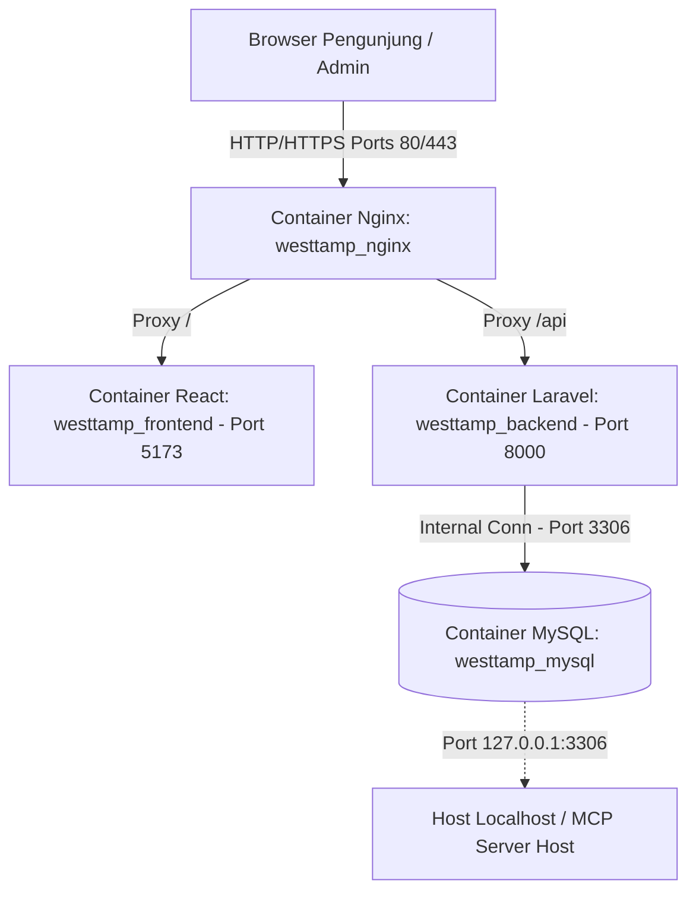
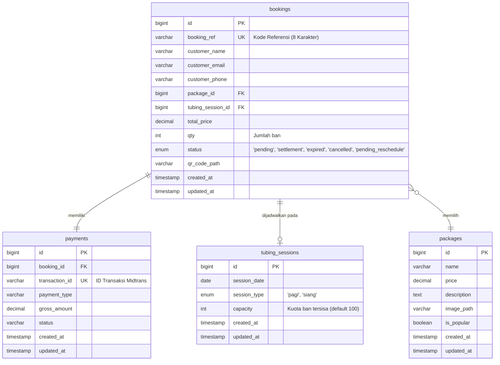

# Software Requirements Specification (SRS)
## Westtamp Tubing — Platform Digitalisasi Wisata River Tubing Desa Tampirkulon

---

| | |
|---|---|
| **Versi Dokumen** | 1.0 |
| **Status** | Approved |
| **Tanggal** | Juni 2026 |
| **Penyusun** | System Analyst |
| **Dokumen Acuan** | PRD v1.1 |

---

## 1. Pendahuluan

### 1.1 Tujuan
Dokumen Software Requirements Specification (SRS) ini merinci spesifikasi teknis dan fungsional sistem **Westtamp Tubing**. Dokumen ini dirancang sebagai acuan teknis bagi tim pengembang (backend & frontend), arsitek sistem, serta tim penjamin mutu (QA) untuk mengimplementasikan dan menguji sistem.

### 1.2 Ruang Lingkup Sistem
Sistem mencakup:
* Portal landing page informasi Desa Wisata Tampirkulon dan UMKM lokal.
* Katalog paket wisata *river tubing*.
* Mesin transaksi tiket online dengan penguncian kuota sementara dan integrasi Payment Gateway Midtrans.
* Alur penjadwalan ulang mandiri oleh pelanggan (reschedule).
* Dasbor administrasi POKDARWIS untuk memantau kapasitas sesi secara real-time, laporan keuangan terperinci (ekspor Excel/PDF), dan panel kendali darurat cuaca (Weather Emergency) yang memproses pembatalan/penundaan massal secara asinkron.

### 1.3 Definisi dan Singkatan
* **POKDARWIS**: Kelompok Sadar Wisata Desa Tampirkulon.
* **SRS**: *Software Requirements Specification*.
* **PRD**: *Product Requirements Document*.
* **Open Ticket**: Status tiket wisatawan yang ditangguhkan jadwalnya (belum ditentukan tanggal/sesinya) akibat kondisi darurat cuaca, sehingga wisatawan dapat menentukan tanggal pengganti secara mandiri tanpa batasan H-1.
* **Midtrans Snap**: Integrasi pembayaran di frontend dalam bentuk modal *pop-up* tanpa meninggalkan halaman aplikasi.
* **Laravel Sanctum**: Sistem autentikasi token ringan untuk API SPA.

---

## 2. Arsitektur Sistem & Lingkungan Operasional

### 2.1 Arsitektur Aplikasi
Sistem menggunakan pola arsitektur **Decoupled SPA-API**:
* **Backend (API)**: Dibangun menggunakan PHP 8.2 dengan Laravel 11. Menggunakan Eloquent ORM untuk pemodelan data dan Laravel Sanctum untuk manajemen sesi API Admin.
* **Frontend (SPA)**: Dibangun menggunakan React 18 dengan Vite sebagai bundler dan Tailwind CSS/Vanilla CSS untuk antarmuka.
* **Reverse Proxy**: Nginx sebagai penyeimbang beban (*load balancer*), penanganan SSL/TLS, dan *reverse proxy* rute frontend dan backend.

### 2.2 Lingkungan Deployment (Docker Compose)
Aplikasi dikemas ke dalam 4 container utama yang berjalan di jaringan virtual internal:

1. **`westtamp_mysql`**: MySQL 8.0. Port 3306 dipetakan secara terbatas ke `127.0.0.1:3306` pada host untuk keperluan perkakas internal (seperti MCP Server).
2. **`westtamp_backend`**: PHP 8.2-FPM. Menjalankan Laravel server di port 8000, composer dependencies, dan PHP CLI queue listener.
3. **`westtamp_frontend`**: Node 20-alpine. Menjalankan dev server React/Vite di port 5173.
4. **`westtamp_nginx`**: Nginx Alpine. Mengikat port fisik 80 dan 443 pada host.

---

## 3. Spesifikasi Data (Desain Database)

### 3.1 Skema Tabel Hubungan Entitas (ERD)

### 3.2 Kebutuhan Indeks Database (Performance Tuning)
Guna menjamin skalabilitas query, indeks harus dipasang pada kolom-kolom berikut:
* **Tabel `bookings`**:
  * Indeks Unik: `booking_ref`
  * Indeks Komposit: `(tubing_session_id, status)` (Untuk perhitungan kuota real-time cepat)
  * Indeks Tunggal: `customer_email`, `status`, `created_at` (Untuk pencarian pemesanan dan filter laporan keuangan)
* **Tabel `tubing_sessions`**:
  * Indeks Komposit: `(session_date, session_type)` (Untuk pencarian ketersediaan sesi saat memilih tanggal kunjungan)

---

## 4. Spesifikasi API (Endpoint & Alur Kerja Logika)

### 4.1 Modul Pemesanan & Pembayaran (Wisatawan)
* **API Checkout**: `POST /api/bookings`
  * **Payload**: `customer_name`, `customer_email`, `customer_phone`, `package_id`, `session_date`, `session_type`, `qty`.
  * **Alur Logika**:
    1. Jalankan `DB::transaction`.
    2. Kunci baris kuota sesi terpilih menggunakan query `SELECT ... FOR UPDATE` (Pencegahan *Race Condition*).
    3. Jika kuota tersisa < `qty`, gagalkan transaksi dengan respons kode HTTP 422 (Kuota Penuh).
    4. Kurangi kuota sesi sebanyak `qty`.
    5. Buat entri pemesanan di tabel `bookings` dengan status `pending` dan buat kode `booking_ref` acak sepanjang 8 karakter alfanumerik.
    6. Panggil Snap API Midtrans untuk membuat *token pembayaran*.
    7. Commit transaksi.
    8. Jadwalkan pembatalan otomatis setelah **15 menit** jika pembayaran tidak selesai (menggunakan cron Laravel Scheduler yang mengeksekusi Artisan Command `app:release-pending-bookings` setiap menit).
  * **Respons**: Kode HTTP 201 dengan `snap_token` dan detail pemesanan.

* **Webhook Midtrans**: `POST /api/payments/webhook`
  * **Alur Logika**:
    1. Hitung ulang signature SHA512 menggunakan `order_id`, `status_code`, `gross_amount`, dan Server Key Midtrans untuk validasi keaslian payload.
    2. Cari data booking berdasarkan `booking_ref` (dipetakan ke `order_id` Midtrans).
    3. Jika status notifikasi adalah `settlement`:
       * Ubah status booking ke `settlement`.
       * Hasilkan QR Code check-in yang merujuk pada endpoint `/api/admin/bookings/verify/{booking_ref}`.
       * Masukkan proses pengiriman email notifikasi e-ticket ke dalam antrean (Laravel Queue) untuk dikirimkan secara asinkron ke `customer_email`.
    4. Jika status notifikasi adalah `expire`, `cancel`, atau `deny`:
       * Kembalikan kapasitas ban (`qty`) dari pemesanan tersebut ke kapasitas sesi (`tubing_sessions`).
       * Ubah status booking ke `expired` atau `cancelled`.
  * **Respons**: HTTP 200 OK.

### 4.2 Modul Penjadwalan Ulang (Reschedule)
* **Verifikasi Kelayakan**: `GET /api/bookings/verify-reschedule`
  * **Query Parameter**: `booking_ref`
  * **Aturan Kelayakan**:
    * Status transaksi wajib `settlement` (sudah bayar) ATAU `pending_reschedule` (Open Ticket akibat Weather Emergency).
    * Jika statusnya `settlement` (reschedule biasa), tanggal sesi awal minimal adalah H-1 dari tanggal saat ini. Jika statusnya `pending_reschedule`, batasan H-1 ini dilewati.
  * **Respons**: HTTP 200 dengan kelayakan `true`/`false` dan sisa kuota tanggal baru yang direferensikan.

* **Proses Reschedule**: `POST /api/bookings/reschedule`
  * **Payload**: `booking_ref`, `new_session_date`, `new_session_type`.
  * **Alur Logika**:
    1. Jalankan `DB::transaction`.
    2. Tarik dan kunci baris kuota sesi baru (`SELECT ... FOR UPDATE`).
    3. Jika kuota baru tidak mencukupi, gagalkan transaksi (HTTP 422).
    4. Kurangi kapasitas sesi baru sebesar `qty` pemesanan.
    5. Tambahkan kapasitas sesi lama sebesar `qty` pemesanan.
    6. Perbarui rujukan `tubing_session_id` pada entri booking ke sesi baru.
    7. Ubah status booking dari `pending_reschedule` kembali menjadi `settlement`.
    8. Kirim email konfirmasi perubahan jadwal sukses ke wisatawan secara asinkron.
    9. Commit transaksi.
  * **Respons**: HTTP 200 OK.

### 4.3 Modul Darurat Cuaca (Weather Emergency)
* **Pemicuan Status Darurat**: `POST /api/admin/weather-emergency`
  * **Payload**: `target_date`, `session_type`.
  * **Alur Logika (Asinkron via Queue)**:
    1. Ambil seluruh data pemesanan (`bookings`) dengan status `settlement` pada sesi dan tanggal terdampak.
    2. Untuk setiap pemesanan:
       * Ubah statusnya menjadi `pending_reschedule` (Open Ticket).
       * Kembalikan kuota ban pemesanan ke sesi tersebut (untuk pencatatan audit, meskipun sesi ini dibatalkan).
       * Kirim email broadcast penangguhan jadwal berisi tautan reschedule instan gratis tanpa batasan H-1.
    3. Catat log Weather Emergency di audit trail.
  * **Respons**: HTTP 202 Accepted (Tindakan diterima dan sedang diproses di latar belakang).

---

## 5. Persyaratan Antarmuka Eksternal (Integration Specification)

### 5.1 Integrasi Payment Gateway (Midtrans)
* **Frontend**: Mengimpor berkas Javascript Snap SDK resmi dari CDN Midtrans di halaman checkout.
  * Sandbox: `https://app.sandbox.midtrans.com/snap/snap.js`
  * Produksi: `https://app.midtrans.com/snap/snap.js`
* **Metode Pemanggilan**: Menggunakan objek `window.snap.pay(token, { onSuccess, onPending, onError, onClose })`.

### 5.2 Sistem Notifikasi Email (SMTP)
* **Kebutuhan Teknis**: Pengiriman email transaksional transparan dari server menggunakan protokol SMTP.
* **Driver & Paket**: Menggunakan *Laravel Mailables* dengan dukungan template Markdown.
* **Konfigurasi Lingkungan (Env)**:
  * Pengembangan: Driver diatur ke `log` (tercatat di `laravel.log`) atau Mailpit (port 1025).
  * Produksi: Menggunakan gateway email transaksional eksternal (Mailgun / SMTP relay AWS SES / Brevo) dengan antrean `queue` diaktifkan di konfigurasi Laravel `queue.php` (`QUEUE_CONNECTION=database`).

---

## 6. Persyaratan Non-Fungsional (Non-Functional Requirements)

### 6.1 Keamanan & Penanganan Ancaman
* **Rate Limiting**:
  * Jalankan batasan kecepatan request pada endpoint checkout (`/api/bookings`) maksimal 5 request per menit per IP address untuk mencegah spam bot transaksi pending yang mengunci kuota ban.
  * Endpoint publik lainnya dibatasi maksimal 60 request per menit.
* **Autentikasi API Admin**:
  * Menggunakan token berbasis bearer melalui Laravel Sanctum yang disimpan dengan aman di memori aplikasi frontend (bukan di LocalStorage yang rentan XSS).
* **Proteksi SQL Injection & XSS**:
  * Seluruh input database harus melalui binding parameter SQL otomatis via Eloquent Query Builder Laravel.
  * Gunakan escaping HTML di frontend saat merender konten dinamis untuk mencegah eksekusi skrip berbahaya.

### 6.2 Konkurensi & Integritas Kuota
* **Mekanisme Lock**: Sistem wajib menggunakan *Pessimistic Locking* (`SELECT ... FOR UPDATE`) pada query pemeriksaan kuota di database MySQL. Mekanisme optimistik (seperti versioning) dihindari karena tingkat kompetisi transaksi kuota ban tinggi di jam-jam sibuk liburan.

### 6.3 Kinerja & Waktu Respons
* **Waktu Pemuatan Halaman**: Halaman statis landing page publik harus terkompilasi optimal (Vite code splitting) dengan target waktu muat penuh kurang dari 3 detik di jaringan seluler 4G.
* **API Latency**: Endpoint verifikasi kuota harus merespons dalam waktu kurang dari 800ms.
